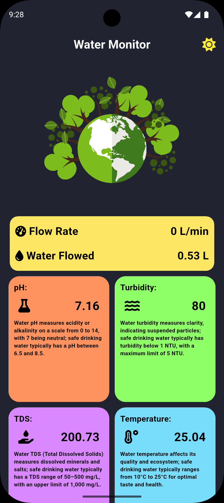
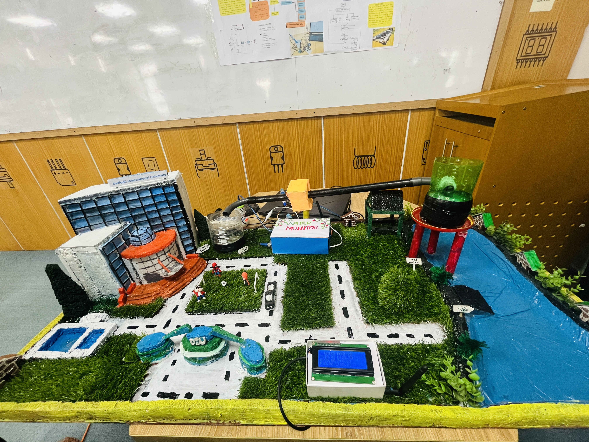

# 💧 Water Quality Monitoring App (Flutter Frontend)

A cross-platform **Flutter application** for visualizing real-time water quality and flow data collected from **LoRa-based IoT sensors** and served by a **Node.js + MongoDB backend**.

The app provides an intuitive dashboard to monitor water parameters and includes an **AI-assisted insight screen** for generating analysis using the backend’s Gemini-powered API.

---

## 🚀 Features

* 📊 Real-time water quality monitoring
* 🌡️ Displays temperature, pH, turbidity, TDS, flow rate, and total water usage
* 🤖 AI-powered analysis via backend integration
* 🎨 Light/Dark theme support
* 🖥️ Runs on **Android, iOS, Web, Windows, Linux, and macOS**
* ✨ Clean UI with reusable components

---

## 🧠 Tech Stack

* **Flutter (Dart)**
* **REST API (Node.js backend)**
* **MongoDB (via backend)**
* **Material UI**
* **Lottie animations**

---

## 🗂️ Project Structure (Important Parts)

```text
lib/
├── main.dart                # App entry point
├── water_app.dart           # Root widget
├── splash_screen.dart       # Splash screen
│
├── models/
│   └── monitored_data.dart  # Sensor data model
│
├── component/
│   ├── all_data_page.dart   # Main dashboard page
│   ├── all_data_card.dart   # Sensor data cards
│   ├── value_card.dart
│   └── value_card_all_data.dart
│
├── ai/
│   └── prompt_result_screen.dart  # AI response screen
│
├── theme/
│   ├── theme.dart
│   └── theme_notifier.dart
│
├── assets/
│   ├── iot.json
│   ├── alert.json
│   └── green.json
```

The rest of the folders (`android`, `ios`, `web`, `windows`, `linux`, `macos`) exist because Flutter believes in commitment.

---

## 🔌 Backend Dependency

This frontend **depends on your backend API**, which provides:

* `/api/data` – fetch all sensor data
* `/api/data/latest` – fetch latest reading
* `/api/content` – AI-generated insights

Make sure the backend server is running **before launching the app**.

---

## ⚙️ Configuration

Update your API base URL inside the Flutter code (usually in a service or directly in API calls):

```dart
const String baseUrl = "http://YOUR_BACKEND_IP:PORT";
```

For Android emulators:

```text
http://10.0.2.2:PORT
```

For physical devices:

```text
http://your-local-ip:PORT
```

---

## 📦 Installation

### 1️⃣ Clone the Repository

```bash
git clone https://github.com/your-username/water-monitor-frontend.git
cd water-monitor-frontend
```

### 2️⃣ Install Dependencies

```bash
flutter pub get
```

### 3️⃣ Run the App

```bash
flutter run
```

Or target a specific platform:

```bash
flutter run -d chrome
flutter run -d windows
flutter run -d android
```

---

## 📱 Supported Platforms

* ✅ Android
* ✅ iOS
* ✅ Web
* ✅ Windows
* ✅ Linux
* ✅ macOS

Flutter really doesn’t like half measures.

---

## 🎨 UI Highlights

* Card-based sensor visualization
* Color-coded values for readability
* Animated splash and alert indicators
* Centralized theming with `ThemeNotifier`

---

📸 Screenshots (Optional)
## 📸 Screenshots




---

## 🔮 Future Enhancements

* Real-time updates using WebSockets
* Data charts & historical trends
* Alert notifications for unsafe values
* Offline caching
* Authentication & user profiles

---

## 👤 Author

**Bishwajit Kumar Chakraborty**
🎓 B.Sc in Computer Science & Engineering
📧 Email: [bishwajit2810@gmail.com](mailto:bishwajit2810@gmail.com)
🔗 GitHub: [https://github.com/Bishwajit-2810](https://github.com/Bishwajit-2810)


